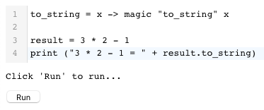
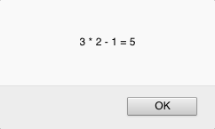

# Passerine Playground
Embeddable in-browser WASM playground for Passerine.

## Try it out
Compiling this one is quite the feat, because we're quite literally orchestrating 4 languages. First, you'll need to have `cargo`, `npm`, and `wasm-pack` installed. Second, clone Passerine and Playground so they're side-by-side:


```
- project
  - passerine
    - Cargo.toml
    - ...
  - playground
    - Cargo.toml
    - site
    - ...
```

Third, in the `playground` directory, run `wasm-pack build` to build passerine as a `wasm` executable. This should create a node package in `playground/pkg`. This package can then be used to run Passerine from JS.

Fourth, to run the playground, `cd` into `playground/site`. Sadly, we have to rely on the JS ecosystem: install dependencies with `npm install` and run the playground locally with `npm run serve`. Eventually, the playground will basically be a little codemirror editor that we can embed on https://passerine.io.

## You should see
Right now, I've hooked up a basic Codemirror editor to Passerine:



Upon hitting run, it'll run it (doh):



This works because I've remapped Passerine's `print` to JS's `alert` through Passerine's FFI. I can't believe it works so easily!

## To be done
- [ ] Make sure passerine is 100% wasm friendly.
- [X] Hook up the Wasm backend to the codemirror frontend
- [ ] Styling, Polish, and Publish!
